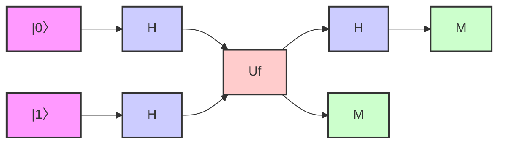

# Quantum

Quantum es un lenguaje de programación simplificado diseñado 
para introducir conceptos de computación cuántica.
____________
____________

### Características Principales

+ **Sintaxis simple y clara**: Quantum está diseñado para ser fácil de leer y escribir, con una sintaxis clara y concisa.
+ ***Operaciones*** cuánticas básicas.
+ ***Simulación*** de circuitos cuánticos básicos.
+ ***Estructuras*** de control clásicas (condicionales e iteradores)
+ ***Lenguaje*** base Python.

### Componentes Básicos

1 - **Qubit**: Un qubit es la unidad básica de información cuántica.

```python
qubit q1 = |0>
qubit q2 = |1>
```

2 - **Puertas Cuánticas**: Las puertas cuánticas son operaciones que se aplican a los qubits.

```python
H(q1)  # Puerta Hadamard
CNOT(q1, q2)  # Puerta CNOT
```

3 - **Medición**: La medición de un qubit colapsa su estado cuántico a un estado clásico.

```python
result = medir(q1)
```

4 - **Estructuras de Control**: Quantum admite estructuras de control clásicas.

```python
if (medir(q1) == 1) {
    X(q2)
}
```

5 - **Iteradores**: Quantum admite bucles clásicos.

```python
for i in range(3) {
    H(q[i])
}
```

### Ejemplo de Programa

#### Algoritmo de Deutsch
***Propósito***:
+ El algoritmo de Deutsch resuelve un problema específico: 
determinar si una función booleana de un bit es constante o balanceada, 
y lo hace con una sola evaluación de la función. 
+ Definiciones:

- Una función booleana f(x) que toma un bit de entrada y produce un bit de salida.
- Constante: f(0) = f(1) (ambos 0 o ambos 1)
- Balanceada: f(0) ≠ f(1) (uno es 0 y el otro es 1)

#### Problema clásico vs. cuántico:

+ Clásicamente: necesitarías evaluar f(0) y f(1) y compararlos, lo que requiere dos evaluaciones.
+ Cuánticamente: el algoritmo de Deutsch puede determinar si f es constante o balanceada con una sola evaluación.



    
```python
# Inicialización de qubits
qubit q1 = |0>
qubit q2 = |1>

# Función booleana
function esBalanceado(control, target) {
    CNOT(control, target)
}

# Algoritmo de Deutsch
H(q1)
H(q2)

esBalancedo(q1, q2)

H(q1)

result = medir(q1)

if (result == 0) {
    print("La función es constante")
} else {
    print("La función es balanceada")
}
```

### Información adicional sobre computación y algoritmos cuánticos

* ***Superposición***: Los qubits pueden existir en múltiples estados simultáneamente, permitiendo procesamiento paralelo masivo.
* ***Entrelazamiento***: Los qubits pueden estar correlacionados de manera que el estado de uno depende instantáneamente del otro, sin importar la distancia.
* ***Interferencia cuántica***: Los estados cuánticos pueden interferir entre sí, permitiendo la amplificación de resultados correctos y la cancelación de incorrectos.

#### Algoritmos cuánticos notables:

+ ***Algoritmo de Shor***: Factorización de números grandes en tiempo polinomial.
+ ***Algoritmo de Grover***: Búsqueda en bases de datos no estructuradas con una aceleración cuadrática.
