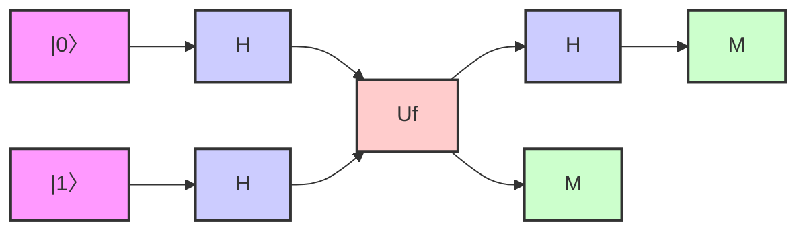

# Quantum

Quantum es un lenguaje de programación simplificado diseñado 
para introducir conceptos de computación cuántica.
____________
____________

### Características Principales

+ **Sintaxis simple y clara**: Quantum está diseñado para ser fácil de leer y escribir, con una sintaxis clara y concisa.
+ ***Operaciones*** cuánticas básicas.
+ ***Simulación*** de circuitos cuánticos básicos.
+ ***Estructuras*** de control clásicas (condicionales e iteradores)
+ ***Lenguaje*** base Python.

### Componentes Básicos

1 - **Qubit**: Un qubit es la unidad básica de información cuántica.

```python
qubit q1 = |0>
qubit q2 = |1>
```

2 - **Puertas Cuánticas**: Las puertas cuánticas son operaciones que se aplican a los qubits.

```python
H(q1)  # Puerta Hadamard
CNOT(q1, q2)  # Puerta CNOT
```

3 - **Medición**: La medición de un qubit colapsa su estado cuántico a un estado clásico.

```python
result = medir(q1)
```

4 - **Estructuras de Control**: Quantum admite estructuras de control clásicas.

```python
if (medir(q1) == 1) {
    X(q2)
}
```

5 - **Iteradores**: Quantum admite bucles clásicos.

```python
for i in range(3) {
    H(q[i])
}
```

### Ejemplo de Programa

#### Algoritmo de Deutsch
***Propósito***:
+ El algoritmo de Deutsch resuelve un problema específico: 
determinar si una función booleana de un bit es constante o balanceada, 
y lo hace con una sola evaluación de la función. 
+ Definiciones:

- Una función booleana f(x) que toma un bit de entrada y produce un bit de salida.
- Constante: f(0) = f(1) (ambos 0 o ambos 1)
- Balanceada: f(0) ≠ f(1) (uno es 0 y el otro es 1)

#### Problema clásico vs. cuántico:

+ Clásicamente: necesitarías evaluar f(0) y f(1) y compararlos, lo que requiere dos evaluaciones.
+ Cuánticamente: el algoritmo de Deutsch puede determinar si f es constante o balanceada con una sola evaluación.



    
```python
# Inicialización de qubits
qubit q1 = |0>
qubit q2 = |1>

# Función booleana
function esBalanceado(control, target) {
    CNOT(control, target)
}

# Algoritmo de Deutsch
H(q1)
H(q2)

esBalancedo(q1, q2)

H(q1)

result = medir(q1)

if (result == 0) {
    print("La función es constante")
} else {
    print("La función es balanceada")
}
```

# Algoritmos Cuánticos Sencillos

***Generador de Bits Aleatorios Cuántico***
   
_Explicación_:
Este algoritmo aprovecha la naturaleza probabilística de la mecánica cuántica para generar bits aleatorios verdaderos. Se basa en el principio de superposición y el colapso de la función de onda durante la medición.

### Cómo funciona:

* Inicializamos un qubit en el estado |0>.
Aplicamos una puerta Hadamard (H) para poner el qubit en superposición.
Medimos el qubit, obteniendo 0 o 1 con igual probabilidad.
Repetimos el proceso para generar múltiples bits aleatorios.

***Teleportación Cuántica Simplificada***
   
_Explicación:_
La teleportación cuántica permite "transferir" el estado de un qubit a otro qubit distante utilizando entrelazamiento y comunicación clásica. Esta versión simplificada muestra los principios básicos sin la comunicación clásica.
   
### Cómo funciona:

Preparamos un estado a teleportar en un qubit.
Creamos un par de qubits entrelazados (estado Bell).
Realizamos una operación de entrelazamiento entre el qubit a teleportar y uno del par entrelazado.
Medimos los dos primeros qubits.
El estado original se "teleporta" al tercer qubit (en un experimento real, se necesitaría comunicación clásica y operaciones adicionales).

# Especificación Léxica del Lenguaje Quantum

## Tabla de Tokens, Lexemas y Patrones

| Token          | Lexema(s)              | Patrón (Regex)         |
|----------------|------------------------|------------------------|
| QUBIT          | "qubit"                | bqubit                 |
| MEDIR          | "medir"                | medir                  |
| SI             | "si"                   | si                     |
| ENTONCES       | "entonces"             | entonces               |
| MIENTRAS       | "mientras"             | mientras               | |
| PRINT          | "print"                | bprint                 |
| ESTADO_QUBIT   | "estado_qubit"         |                        |1>"                | \|[01]>                     |                |X|CNOT)\b              |
| VARIABLE       | (nombres de variables) | [a-zA-Z_][a-zA-Z0-9_]* |
| NUMERO         | (números enteros)      | [0-9]*                 |
| IGUAL          | "="                    | =                      |
| SUMA           | "+"                    | \+                     |
| RESTA          | "-"                    | -                      |
| MULTIPLICACION | "*"                    | \*                     |
| DIVICION       | "/"                    | /                      |
| LPAREN         | "("                    | \(                     |
| RPAREN         | ")"                    | \)                     |
| LBRACKET       | "["                    | \[                     |
| RBRACKET       | "]"                    | \]                     |
| COMA           | ","                    | ,                      |
| DOSPUNTOS      | ":"                    | :                      | |


## Próximos pasos:

1. Implementar una función de tokenización que utilice estos patrones para convertir el código fuente en una serie de tokens.
2. Manejar casos especiales como la indentación y los comentarios.
3. Implementar el manejo de errores para caracteres o patrones no reconocidos.
